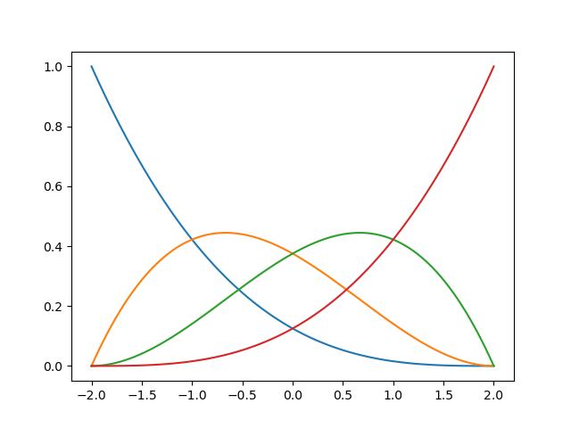
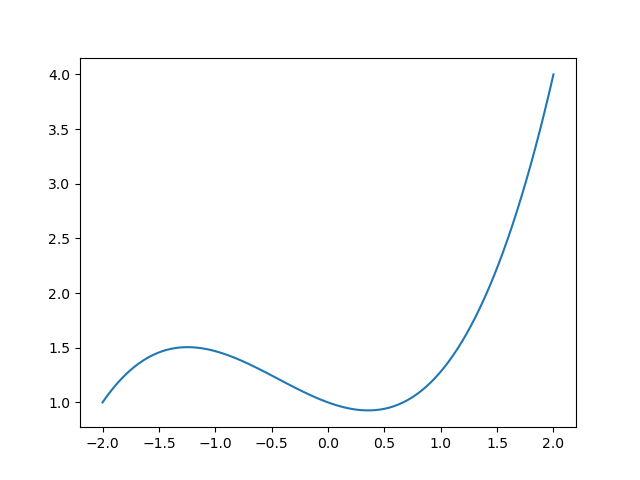
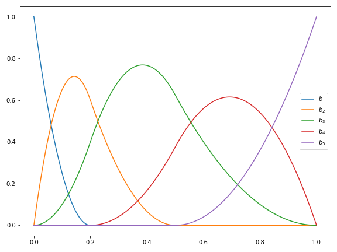
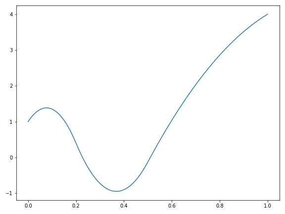
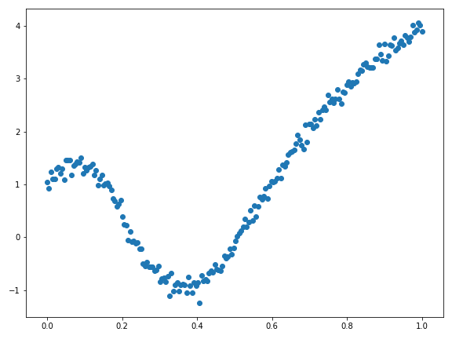
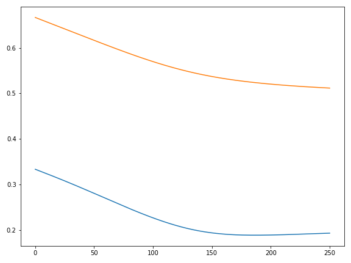
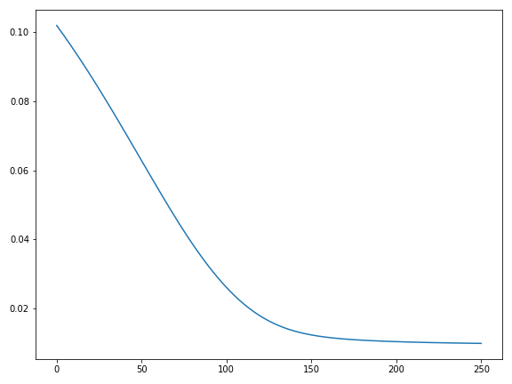
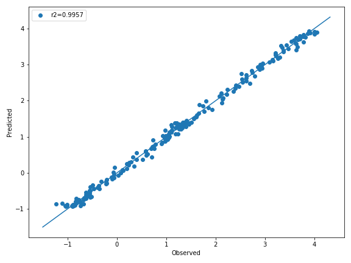
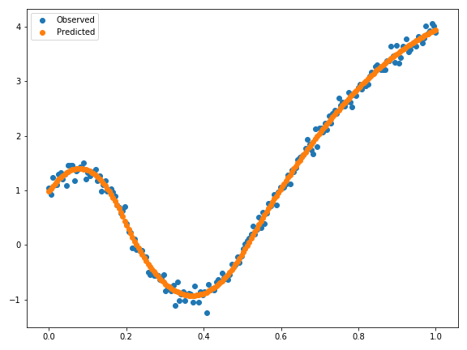

# Adaptive Multi-Variate Spline Regression
This project is the result of a Master Thesis entitled *Adaptive Multi-Variate Splines as a Meta-Model for Vehicle Safety* by George Dekermenjian submitted to mathematics department at [Technical University of Munich](https://www.ma.tum.de/) in September 2020 in partial fulfillment of the Master of Science of Mathematics in Data Science.

- TUM Advisor: [PD Peter Massopust, Ph.D.](https://www-m15.ma.tum.de/Allgemeines/PeterMassopust)
- Advising Ph.D. Candidate: Jonas Jehle [jonas.jehle@unibw.de](mailto:jonas.jehle@unibw.de)

Coming Soon:
- Link to Master Thesis
- Link to Preprint of Paper

## Installation
Requirements
-  `python>=3.7`
 - `numpy>=1.18.5`
 - `tqdm>=4.48.2`
 - `scikit-learn>=0.23.1`
 - `setuptools>=49.2.0`

To install just run `pip install fksplines`

## Usage

I have tried to make the classes follow design patterns similar (but not exactly the same) as the `LinearRegression` class from Sci-Kit Learn.

### Initialization

First we import the object:

    from splines.regression import SplineRegression

Initialize a `SplineRegression` object. The following code has the default values of the arguments.

    s=SplineRegression(num_of_vars=2,
                       orders=[2,2],
                       intervals=[(0,1),(0,1)])                     

This initializes a bi-variate tensor-product `SplineRegression` object.

To do uni-variate regression, using 4th order B-Splines, on the interval `(-2,2)`, adjust the values of the arguments accordingly:

    s=SplineRegression(num_of_vars=1,
                       orders=[4],
                       intervals=[(-2,2)])

### Visualize B(asis)-Splines

Below, we are using the uni-variate `SplineRegressor` object defined above.

    import matplotlib.pyplot as plt
    import numpy as np    
    x = np.linspace(-2, 2, 100).reshape(-1,1)
    y = s.b_splines(x) # shape (100, 4) there are 4 B-splines
    # order + number of knots = 4 + 0 = 4
    plt.plot(x, y)
    plt.show()        

A linear combination of these basis splines produces a spline, a piece-wise polynomial. To do this, we need to set the 4 coefficients.

    s.coefficients = np.array([1,3,-2,4])

We can now compute and visualize the spline.

    y_spline = s.predict(x)
    plt.plot(x, y_spline)
    plt.show()              

## Spline Basics
At a high-level, uni-variate B-splines are piecewise polynomials, where the breakpoints are determined by the **knots**. B-splines are determined by their order *k* (degree + 1) and their interior knots. The B-splines we consider in this work are open knot-sequences. In other words, for an interval  the full knot sequence has, in addition to the interior knots, *k* copies of each of the endpoints. So for order  and the interior knot sequence  on the interval , the full knot_sequence is given by . Carl De Boor gives a recursive definition of B-Splines as well as a complete treatment of their properties. At a basic level, one should note that there are  B-splines defined on an interval  where *k* denotes the order and *p* denotes the number of interior knots. Thus, for the example above,  and  and therefore, there are  B-splines. A linear combinations of these B-splines forms a Spline function, which also a piecewise polynomial function. In fact, any piecewise polynomnial function can be written uniquely as a linear combination of B-splines with a suitable interior knot sequence.

Below is a plot of the 5 B-Spline functions of order 3 with interior knots sequence containing 0.2 and 0.5.

Now let  be the coefficients of the B-splines. The spline function, which is linear combinations of the B-splines is shown below.

## Regression with Uni-Variate Splines
If the (order and) knot sequence is pre-determined, then fitting a spline function to the data is a straightforward problem. We can just find the least-squares solution of the coefficients using the normal equations or gradient-descent algorithm. However, the hypothesis space of function is grealy increased, and therefore the expressiveness of the regression model, if we were to also learn the locations of the knots. To this end, we implement a gradient-based optimization scheme to learn the interior knots. All we have to specify is the order of the spline and the number of knots.

Below is a figure showing a scatter plot of some noisy training data generated using the spline function above.

The algorithm initializes the interior knot sequence to be equally spaced. So in our case it would be . Once the model is fit, we can access a number of properties of the training and the fitted model. Below is a plot of the knot sequence history during training. Recall that the true knot sequence used to generate the data is from the example above.

Next, we show the history of the mean-squared error over the course of the training.

Next, a scatter plot showing the predicted values using the fitted spline object and the observed values.

Finally, the observed data and the fitted spline object overlayed.

## Regression with Multi-Variate Splines

Coming soon...